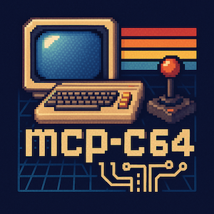

# mcp-c64


## An MCP server for developing BASIC and Assembly Language programs for the Commodore 64

* Optimal C64 development stack
  * Emulator: [`VICE`](https://vice-emu.sourceforge.io/manual/vice.pdf)
  * Assembler: [`64tass`](https://tass64.sourceforge.net/) 
  * Tokenizer: [`petcat`](https://vice-emu.sourceforge.io/vice_toc.html#TOC390)
* REPL - A minimal command line client for interacting directly with the MCP server.
* MCP Server working with the ability to:
  * Assemble 6502 assembly language programs to .prg format
  * Tokenize BASIC programs to .prg format
  * Launch and run .prg format programs in the emulator

## Local Setup
### Install
* **Node + npm** - Javascript runtime environment
  * <a href="https://nodejs.org/en/download" target="_blank">Install</a> the latest stable Node release (comes with npm).

* **VICE** - The Versatile Commodore Emulator
  * Read the [Manual](https://vice-emu.sourceforge.io/manual/vice.pdf)
  * [Download binary for your platform](https://vice-emu.sourceforge.io/index.html#download)
  * Includes emulator and tokenizer/detokenizer (petcat)

* **64Tass** - The 6502 assembler for C64
  * Read the [Manual](https://tass64.sourceforge.net/)
  * Install
    * MacOSX - `brew install tass64`
    * Windows - [Download the latest binary](https://sourceforge.net/projects/tass64/files/binaries/)
    
### Configure
#### Create **.env** file
  * Create file `.env`  in the root of the project by copying `.env-example` 
  * **NOTE**: It will not be stored in your git repo
  * Add / modify vars
  * `ASSEMBLER` - pointing to the `64tass` assembler executable (full path if not in PATH)
  * `TOKENIZER` - pointing to the `petcat` tokenizer executable (full path if not in PATH)
  * `EMULATOR`  - pointing to the `x64sc` emulator executable (full path if not in PATH)
  * `ASM_PATH`  - pointing to your assembly source folder
  * `BASIC_PATH`- pointing to your basic source folder

#### Example `.env` file
```bash
ASSEMBLER=64tass
TOKENIZER=/Users/zaphod/vice/bin/petcat
EMULATOR=/Users/zaphod/vice/x64sc.app/Contents/MacOS/x64sc

ASM_PATH=./asm/hello
BASIC_PATH=./basic/token
```

#### Example `mcp.json` file for Cursor
```json
{
  "mcpServers": {
    "server-name": {
      "command": "npx",
      "args": ["-y", "mcp-c64"],
      "env": {
        "ASSEMBLER": "64tass",
        "TOKENIZER": "/Users/zaphod/vice/bin/petcat",
        "EMULATOR": "/Users/zaphod/vice/x64sc.app/Contents/MacOS/x64sc",
        "ASM_PATH": "/Users/zaphod/Projects/mcp-c64/asm/",
        "BASIC_PATH": "/Users/zaphod/Projects/mcp-c64/basic/"
      }
    }
  }
}
```

#### Example configuration for Github Copilot
```json
{
    "servers": {
         "mcp-c64": {
             "type": "stdio",
             "command": "node",
             "args": ["/Users/zaphod/Projects/mcp-c64/dist/index.js"],
             "env": {
                 "ASSEMBLER": "64tass",
                 "TOKENIZER": "/Users/zaphod/vice/bin/petcat",
                 "EMULATOR": "/Users/zaphod/vice/x64sc.app/Contents/MacOS/x64sc",
                 "ASM_PATH": "/Users/zaphod/Projects/mcp-c64/asm/",
                 "BASIC_PATH": "/Users/zaphod/Projects/mcp-c64/basic/"
             }
         }
    }
}
```

## The REPL
A minimal MCP Client which allows you to interact with the mcp-c64 server. It doesn't invoke LLMs but rather allows you to invoke the tools as an LLM would.

### Running the REPL
* Invoke with `npm run repl`
* You will see a menu of available commands.

```text
MCP Interactive Client
=====================
Connected to mcp-c64 server via STDIO transport

Available commands:
  help                       - Show this help
  list-tools                 - List available tools
  call-tool <name> [args]    - Call a tool with optional JSON arguments
  quit                       - Exit the program

> 
```

### The list-tools command

* Lists the available tools in the MCP server.
* These are the tools that the LLM could call, and the descriptions it would see


```text
> list-tools
Available tools:
- assemble_program: Assemble an assembly language program.
    Only the .asm source filename is required in file parameter, output .prg and .map files will be generated.
    Any additional args such as -a, -cbm-prg, etc. should be supplied in an array in the args parameter.
- tokenize_program: Tokenize a BASIC program.
    Only the .bas source filename is required in file parameter, output .prg file will be generated.
    Any additional args such as -w2, etc. should be supplied in an array in the args parameter.

> 
```

### The call-tool command

* Allows you to call a tool on the MCP server just as the LLM would
* You pass the tool name and its arguments as a JSON string

#### `assemble_program` tool

* Uses `64tass` to assemble a 6502 assembly language program
* To target the Commodore 64 using Unicode or standard ASCII input, include the `-a` and `-cbm-prg` arguments
* Refer to the `64tass` [command line options reference](https://tass64.sourceforge.net/#commandline-options) for more info on configuring the assembler behaviors

```text
> call-tool assemble_program {"file":"hello_world.asm", "args": ["-a", "--cbm-prg"]}
Calling tool 'assemble_program' with args: { file: 'hello_world.asm', args: [ '-a', '--cbm-prg' ] }
Tool result:
{
  output: '64tass Turbo Assembler Macro V1.60.3243\n' +
    '64TASS comes with ABSOLUTELY NO WARRANTY; This is free software, and you\n' +
    'are welcome to redistribute it under certain conditions; See LICENSE!\n' +
    '\n' +
    'Assembling file:   asm/hello/hello_world.asm\n' +
    'Output file:       asm/hello/hello_world.prg\n' +
    'Passes:            2\n',
  error: '',
  status: 0
}

>
```

#### `tokenize_program` tool

* Uses the `petcat` command included with the VICE emulator
* To tokenize a Unicode or standard ASCII file for the Commodore 64, include the `-w2` argument
* See the `petcat` [command line options reference](https://vice-emu.sourceforge.io/vice_16.html#SEC390) for more info on configuring the tokenizer input and output behavior
* See the C64-Wiki for [PETSCII control characters](https://www.c64-wiki.com/wiki/control_character) that can be used in BASIC strings for such things as cursor movement and character color

```text
> call-tool tokenize_program {"file":"token_test.bas", "args": ["-w2","-v"]}}
Calling tool 'tokenize_program' with args: { file: 'token_test.bas', args: [ '-w2', '-v' ] }
Tool result:
{
  output: '/Users/cliffhall/Projects/mcp-c64\n',
  error: '\nLoad address 0801\nControl code set: enabled\n\n',
  status: 0
}

> 
```


#### `run_program` tool

* Uses the `x64sc` executable included with the VICE emulator package
* To take a screenshot on exit, include the `-exitscreenshot` argument followed by a file name argument
* See the `x64sc` [command line options reference](https://vice-emu.sourceforge.io/vice_2.html#SEC49) for more info on configuring the emulator behavior

```text
> call-tool run_program {"file":"token_test.prg", "path":"/Users/zaphod/Projects/mcp-c64/basic/token", "args": ["-exitscreenshot","token_test.png"]}
Calling tool 'run_program' with args: {
  file: 'token_test.prg',
  path: '/Users/zaphod/Projects/mcp-c64/basic/token',
  args: [ '-exitscreenshot', 'token_test.png' ]
}
Tool result:
{ output: '', error: '', status: 0 }

> 
```
